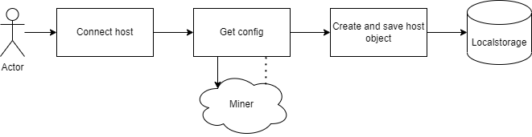
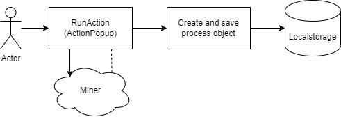
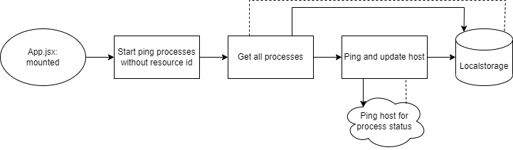
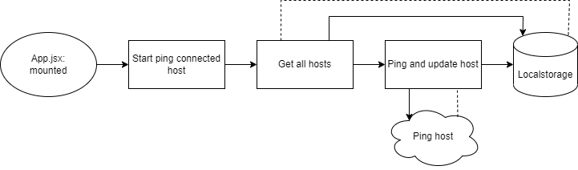
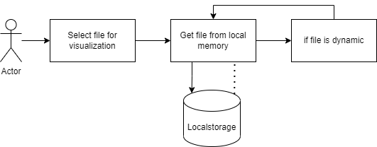
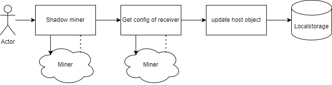

# Getting Started with Create React App

This project was bootstrapped with [Create React App](https://github.com/facebook/create-react-app).

## Available Scripts

In the project directory, you can run:

### `npm start`

Runs the app in the development mode.\
Open [http://localhost:3000](http://localhost:3000) to view it in your browser.

The page will reload when you make changes.\
You may also see any lint errors in the console.

### `npm test`

Launches the test runner in the interactive watch mode.\
See the section about [running tests](https://facebook.github.io/create-react-app/docs/running-tests) for more information.

### `npm run build`

Builds the app for production to the `build` folder.\
It correctly bundles React in production mode and optimizes the build for the best performance.

The build is minified and the filenames include the hashes.\
Your app is ready to be deployed!

See the section about [deployment](https://facebook.github.io/create-react-app/docs/deployment) for more information.

### `npm run eject`

**Note: this is a one-way operation. Once you `eject`, you can't go back!**

If you aren't satisfied with the build tool and configuration choices, you can `eject` at any time. This command will remove the single build dependency from your project.

Instead, it will copy all the configuration files and the transitive dependencies (webpack, Babel, ESLint, etc) right into your project so you have full control over them. All of the commands except `eject` will still work, but they will point to the copied scripts so you can tweak them. At this point you're on your own.

You don't have to ever use `eject`. The curated feature set is suitable for small and middle deployments, and you shouldn't feel obligated to use this feature. However we understand that this tool wouldn't be useful if you couldn't customize it when you are ready for it.

## Learn More

You can learn more in the [Create React App documentation](https://facebook.github.io/create-react-app/docs/getting-started).

To learn React, check out the [React documentation](https://reactjs.org/).

### Code Splitting

This section has moved here: [https://facebook.github.io/create-react-app/docs/code-splitting](https://facebook.github.io/create-react-app/docs/code-splitting)

### Analyzing the Bundle Size

This section has moved here: [https://facebook.github.io/create-react-app/docs/analyzing-the-bundle-size](https://facebook.github.io/create-react-app/docs/analyzing-the-bundle-size)

### Making a Progressive Web App

This section has moved here: [https://facebook.github.io/create-react-app/docs/making-a-progressive-web-app](https://facebook.github.io/create-react-app/docs/making-a-progressive-web-app)

### Advanced Configuration

This section has moved here: [https://facebook.github.io/create-react-app/docs/advanced-configuration](https://facebook.github.io/create-react-app/docs/advanced-configuration)

### Deployment

This section has moved here: [https://facebook.github.io/create-react-app/docs/deployment](https://facebook.github.io/create-react-app/docs/deployment)

### `npm run build` fails to minify

This section has moved here: [https://facebook.github.io/create-react-app/docs/troubleshooting#npm-run-build-fails-to-minify](https://facebook.github.io/create-react-app/docs/troubleshooting#npm-run-build-fails-to-minify)


# Understanding the code

This section is targeted towards developers

## The systems

The overall systems in the frontend is designed to support the desired flow of Process Mining professor Andrea Burratin.

### Hosts

Hosts are represented as objects that are saved in local memory.



```js
{
    addedFrom: hostname_of_service_registry_or_local,
    config: config_of_resource,
    id: uuid_id_made_in_frontend,
    name: hostname_of_resource,
    status: "online" || "offline",
    type: { 
        label: "miner" || "repository" || "service registry", 
        value: "miner" || "repository" || "service registry"
    }
}
```

### Processes

Processes is are represented as javascript objects located in local memory that has information of which foreign process is running. From the frontend, this is used to determine the state of the foreign process, and when to retreive the results. To create a process, create a process object, and save it to localmemory. In App.jsx, exists an interval, that will ping running processes, thus keeping the system up to date with all processes created from the current unit.



Processes are created upon submitting an action from the action popup. This will save a process to local memory, which will then be handled in an inverval which will check status, and respond accordingly by either getting a metadata and file, or by setting and error. Only "running" processes will be pinged. 

A process looks like this:
```js
{
    id: some_uuid,
    objectType: "process",
    hostname: hostname.net.org.com,
    processId: number_from_miner,
    processName: label_from_miner,
    status: "running || complete || crash || stopped",
    progress: 0,
    startTime: number_of_ms_since_1970,
    endTime: number_of_ms_since_1970,
    outputDestination: somedestinationhostname.net.org.com,
    error: null,
    resourceId: some_uuid,
    saveOrUpdateFile: bool,
    resourceLabel: name_of_generated_resource,
}
```

1. <b>id:</b> Key that is used for storing and referencing this object from localMemory.
2. <b>objectType:</b> Used to filter processes from files and hosts in localMemory.
3. <b>hostname:</b> Reference to the host where the process is/was running.
4. <b>processId:</b> Reference to the processId generated by the miner that is/was running.
5. <b>processName:</b> Name of the process that is running. Given by the miner (e.g. "Alpha miner").
6. <b>status:</b> The status of the process, given from the miner.
7. <b>progress:</b> How long has the process been running (currentTime - startTime || endTime - startTime)
8. <b>startTime:</b> Represented as ms since 1970. src/Utils/Utils.js help convert to human understandable format.
9. <b>endTime:</b> Represented as ms since 1970. src/Utils/Utils.js help convert to human understandable format.
10. <b>outputDestination:</b> Where the mining result will be sent.
11. <b>error:</b> Errors will be save in this attribute.
12. <b>resourceId:</b> Reference to the output that is created from this process.
13. <b>saveOrUpdateFile:</b> A boolean that determines if the output should be saved/updated. Is only changed and read in src/Utils/ServiceHelper.js.
14. <b>resourceLabel:</b> Reference to the name of the generated file. As Files and Processes are split, and can be deleted indepedently, this ensures the process has the name of the file. 

### Files

Files consist of two components: Metadata and content. Metadata is a bunch of information wrapping the contents in this application, while it might be seen differently on external services.

the Files are saved like this in local memory:
```js
{
    CreationDate: "some_number_of_ms_since_1970",
    GenerationTree : {
        Children: null,
        GeneratedFrom: {
            SourceHost: "hostname_of_miner_that_created_this_resource", 
            SourceId: "id_of_miner_that_created_this_resource", 
            SourceLabel: "name_of_miner_that_created_this_resource"
        },
        Parents: [
            {
                ResourceId: "parent_resourceId", 
                UsedAs: "miner_config_ResourceInput_value"
            }
        ]
    },
    ResourceId: "id_of_self_generated_from_repository",
    ResourceInfo: {
        Description: "description_of_self",
        Dynamic: false, // Shows if resource can change
        FileExtension: "file_extension_of_self e.g. png, pnml, bpmn",
        Host: "{hostname}/resources/",
        ResourceLabel: "name_of_self",
        ResourceType: "EventStream || ProcessModel || PetriNet || Histogram",
        StreamTopic: "topic_of_self_if_stream",
    },
    fileContent: the_file_contents,
    processId: reference_to_process_that_created_file
}
```

#### Metadata

The file metadata is a javascript object, that has relevant information pretaining to a file. The contents is used to display information in various areas of the frontend, and helped to determine that type, visualization posibilities and completion state of a file. Much of the information is also used to determine if communcation is necessary with either the producer, or the repository that holds it.

How this information is used for this project:

1. <b>CreationDate:</b> This is used for sorting files, as well as a deplay value on file cards in the sidebar. Utility functions found in /src/Utils/Utils are used to convert the format into human readable information.
2. <b>Generation tree:</b> This is information is only used in repository and miner
3. <b>ResourceId:</b> The metadata is stored in localMemory using this key, and therefore the key to accessing the information from a specific file.
4. <b>ResourceInfo:</b>
    1. <b>Description:</b> Not implemented. Intented for additional information.
    2. <b>Dynamic:</b> Is resource expected to update. Resource will be requested in regular intervals when selected in the visualizations screen (only the file that is selected).
    3. <b>FileExtension:</b> Used by miner and repository for running and saving.
    4. <b>Host:</b> Owner of the file. Used to request for updates, or by miner to fetch the file from repository.
    5. <b>ResourceLabel:</b> The name of the file seen everywhere on the frontend.
    6. <b>ResourceType:</b> Used to determine which visualization can be displayed. Also used to filter input files when running a miner, to only provide allowed files.
    7. <b>StreamTopic:</b> A pointer to a stream on a broker located on the address showed in the "Host" attibute.
5. <b>FileContent:</b> This key only exist in the frontend, and holds the file data. This could be a BPMN string, a saved image or otherwise.
6. <b>ProcessId:</b> Reference to the process that spawned this file. This is created when starting a process from the frontend, and saved in the output files object on this key.

#### Content

The file contents are important for certain file types. This will be the actual text, image or other that the file consists of. For log files, we don't want to save it on the frontend, but BPMN is necessary to visualize the model. The contents is added to the file Metadata in local memory. Metadata will always be requested before requesting the file contents. This is necessary because the frontend will never make changes to these objects, thus relying on external processes to update them. 

### Service helper

ServiceHelper.js is an important file, as it consist of function that measures external data such as process status, files and hosts. Each function is designed to run once, where an interval in the App.jsx will be responsible for running the functions. The interval-values can be found in the config.js. 





### Visualizations

The rules that determine what visualizations the frontend can display, can be found in config.js. The contents of metadata will be compared to the list of allowed visualizations, and pull information from repository as needed. Therefore, the frontend will not show content that cannot be visualized yet. 

To add visualizations, go to config.js and change the visualizationConfig variable. The structure of the object is:
The outer most key is a ResourceType, which determines what can be visualized. For example, there is no option for flowcharts, but there are options for processModels. Within the ResourceType object is a set of file extentions that is allowed for the representation of that ResourceType. Forexample, ProcessModels can be represented as BPMN or image types, but PetriNets can only be represented as images as there is no PNML visualizer currently implemented. 



#### Create a new visualization

1. Add a new folder in /src/Components/Visualizations
2. Add a .jsx and .scss file in the new folder
3. Create the visualization component
4. Add the component by importing your new component in Visualizations.jsx
5. Near the bottom of the return in Visualizations.jsx, add your condition and component

### Popups

Most actions that user can do, happens in a popup. This allows for clear distinction of what a user can do, while keeping more space free for visualizations and overview of added processes and files. 

#### Create a new popup

1. Add a state variable in App.jsx.
2. Add a toggle function for the variable.
3. Add the variable, setter and toggle function to the props object sent to the Home.jsx component.
4. Create a new folder in /src/Components/Popup and add a .jsx file and a .scss file.
5. Create a component using the utility components BackdropModal Popup from the Widgets folder.
6. Add the component in the Home.jsx return, and set the condition for displaying as the state variable from step 1.

### Clone a miner

It is possible to close an executable miner from one host to another. This will update the configuration of the receiver and thereby requires all interested parties to retrieve the new configuration. The purpose of this feature is to allow users to run programs from a controlled environment, which provides options for using sensitive data, or measure efficiency. 

