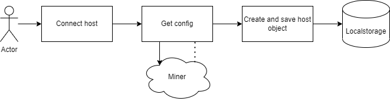
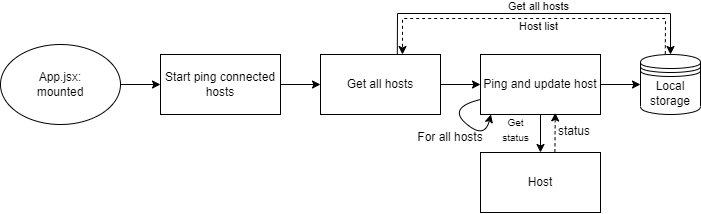
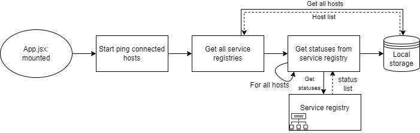
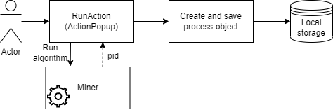
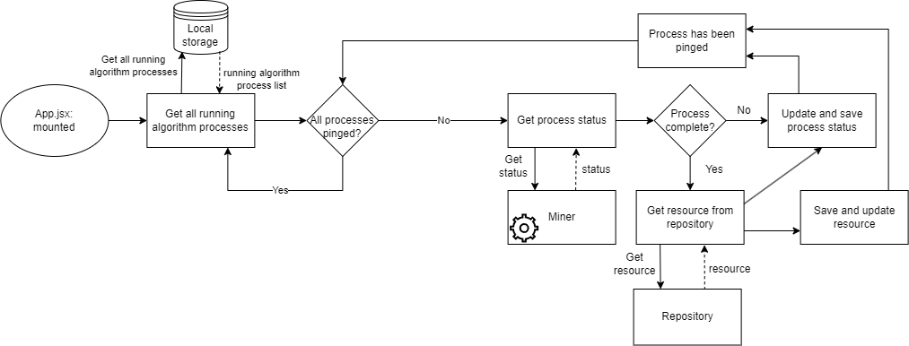
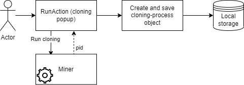
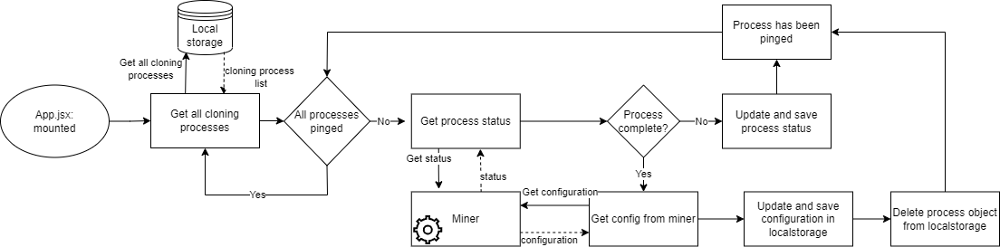
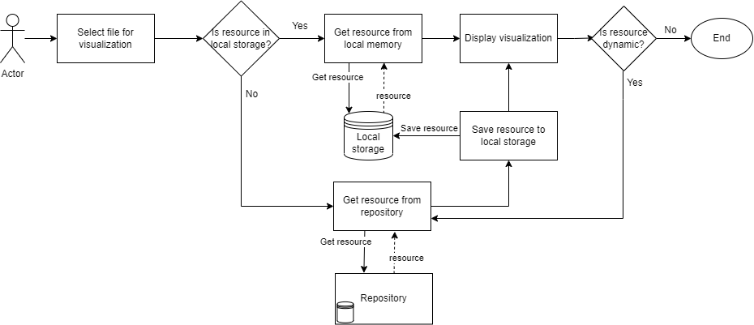

# Scripts and startup

In the project directory, you can run:

### `npm install`

Navigate to the location of this project on your machine and run:
```
npm install
```
This will install all the required dependencies needed to run the application.

### `npm start`

Navigate to the location of this repository on your machine and run:
```
npm start
```
The frontend is hosted at [http://localhost:8080](http://localhost:8080).

### `npm run build`
If you want to get the application ready for production, navigate to the location of this repository on your machine and run:
```
npm run build
```

This builds the app for production to the `build` folder.\
It correctly bundles React in production mode and optimizes the build for the best performance.

The build is minified and the filenames include the hashes.\
Your app is ready to be deployed!

See the section about [deployment](https://facebook.github.io/create-react-app/docs/deployment) for more information.

# Understanding the code

This section is targeted toward developers

### Services

Services are represented as objects that are saved in local memory.

Connecting a service can happen through a service registry or directly by inserting the URL of the service. This will influence how a service status and configuration will be retrieved. 

The following shows how adding a service will add a new object to the local memory.



Services are pinged regularly for status, but as mentioned this differs depending on the method used to add the service to the frontend. 

Getting status from directly added service:



Getting status from service add through a service registry.



Below is seen the object structure saved in local memory. The status and configuration properties can change depending on what happens in the service:

```
{
    addedFrom: hostname_of_service_registry_or_local,
    config: config_of_resource,
    id: uuid_id_made_in_frontend,
    name: hostname_of_resource,
    status: "online" || "offline",
    type: { 
        label: "miner" || "repository" || "service registry", 
        value: "miner" || "repository" || "service registry"
    }
}
```

### Processes

Processes are represented as javascript objects located in local memory with information on which foreign process is running. From the frontend, this is used to determine the state of the foreign process, and when to receive the results. To create a process, create a process object, and save it to local memory. In App.jsx, an interval exists that will ping running processes, thus keeping the user up to date with all processes created by the initiator.

There are two types of processes, and thereby two process objects. The first type is starting an algorithm, which will create a process to track status, output, and other useful information. The second is started when cloning an algorithm is initiated. 

Processes are created upon successfully submitting an action to a miner. This will save a process to local memory, which will then be handled in an interval which will check the status, and respond accordingly by either getting a metadata and file or by setting an error. Only "running" processes will be pinged. 

#### Running an algorithm process

Starting an algorithm process:



Getting the status of a algorithm process:



#### Running a cloning process

Starting an cloning process:



Getting the status of a cloning process:



An algorithm process looks like this:
```
{
    id: some_uuid,
    objectType: "process",
    hostname: hostname.net.org.com,
    processId: number_from_miner,
    processName: label_from_miner,
    status: "running || complete || crash || stopped",
    progress: 0,
    startTime: number_of_ms_since_1970,
    endTime: number_of_ms_since_1970,
    outputDestination: somedestinationhostname.net.org.com,
    error: null,
    resourceId: some_uuid,
    saveOrUpdateFile: bool,
    resourceLabel: name_of_generated_resource,
}
```

1. <b>id:</b> Key that is used for storing and referencing this object from local memory.
2. <b>objectType:</b> Used to filter processes from files and hosts in local memory.
3. <b>hostname:</b> Reference to the host where the process is/was running.
4. <b>processId:</b> Reference to the processId generated by the miner that is/was running.
5. <b>processName:</b> Name of the process that is running. Given by the miner (e.g. "Alpha miner").
6. <b>status:</b> The status of the process, given from the miner.
7. <b>progress:</b> How long has the process been running (currentTime - startTime || endTime - startTime)
8. <b>startTime:</b> Represented as ms since 1970. src/Utils/Utils.js help convert to a human-understandable format.
9. <b>endTime:</b> Represented as ms since 1970. src/Utils/Utils.js help convert to a human-understandable format.
10. <b>outputDestination:</b> Where the mining result will be sent.
11. <b>error:</b> Errors will be save in this attribute.
12. <b>resourceId:</b> Reference to the output that is created from this process.
13. <b>saveOrUpdateFile:</b> A boolean that determines if the output should be saved/updated. Is only changed and read in src/Utils/ServiceHelper.js.
14. <b>resourceLabel:</b> Reference to the name of the generated file. As Files and Processes are split and can be deleted independently, this ensures the process has the name of the file. 

Cloning algorithms consist of much of the same structure but has fewer keys as no resource will be generated.  

### Files

Files consist of two components: Metadata and content. Metadata is a bunch of information wrapping the contents in this application, while it might be seen differently on external services.

#### Metadata

The file metadata is a javascript object, that has relevant information pertaining to a file. The contents are used to display information in various areas of the frontend, and determine the type, visualization possibilities, and completion state of a file. Much of the information is also used to determine if communication is necessary with either the producer or the repository that holds it.

the Files are saved like this in local memory:
```
{
    CreationDate: "some_number_of_ms_since_1970",
    GenerationTree : {
        Children: null,
        GeneratedFrom: {
            SourceHost: "hostname_of_miner_that_created_this_resource", 
            SourceId: "id_of_miner_that_created_this_resource", 
            SourceLabel: "name_of_miner_that_created_this_resource"
        },
        Parents: [
            {
                ResourceId: "parent_resourceId", 
                UsedAs: "miner_config_ResourceInput_value"
            }
        ]
    },
    ResourceId: "id_of_self_generated_from_repository",
    ResourceInfo: {
        Description: "description_of_self",
        Dynamic: false, // Shows if resource can change
        FileExtension: "file_extension_of_self e.g. png, pnml, bpmn",
        Host: "{hostname}/resources/",
        ResourceLabel: "name_of_self",
        ResourceType: "EventStream || ProcessModel || PetriNet || Histogram",
        StreamTopic: "topic_of_self_if_stream",
    },
    fileContent: the_file_contents,
    repositoryUrl: used_to_request_the_actual_file
    processId: reference_to_process_that_created_file
}
```

How this information is used for this project:

1. <b>CreationDate:</b> This is used for sorting files, as well as a value displayed on file cards in the sidebar. Utility functions found in /src/Utils/Utils are used to convert the format into human-readable information.
2. <b>Generation tree:</b> This is information is only used in repository.
3. <b>ResourceId:</b> The metadata is stored in local memory using this key, and therefore the key to accessing the information from a specific file.
4. <b>ResourceInfo:</b>
    1. <b>Description:</b> Not implemented. Intended for additional information.
    2. <b>Dynamic:</b> Is resource expected to update. The resource will be requested in regular intervals when selected in the visualizations screen (only the file that is selected).
    3. <b>FileExtension:</b> Used by miner and repository for running and saving.
    4. <b>Host:</b> Owner of the file. Used to request updates, or by miner to fetch the file from repository.
    5. <b>ResourceLabel:</b> The name of the file is seen everywhere on the frontend.
    6. <b>ResourceType:</b> Used to determine which visualization can be displayed. Also used to filter input files when running a miner, to only provide allowed files.
    7. <b>StreamTopic:</b> A pointer to a stream on a broker located on the address shown in the "Host" attribute.
5. <b>FileContent:</b> This key only exist in the frontend, and holds the file data. This could be a BPMN string, a saved image, or otherwise.
6. <b>repositoryUrl:</b> This key is used as a reference to get the actual file content.
7. <b>ProcessId:</b> Reference to the process that spawned this file. This is created when starting a process from the frontend, and saved in the output files object on this key.

#### File content

The file contents are important for certain file types. This will be the actual text, image, or other that the file consists of. For log files, we don't want to save it on the frontend and request a histogram instead, but BPMN is necessary to visualize the model. The contents are added to the file Metadata in local memory. Metadata will always be requested before requesting the file contents. This is necessary because the frontend will never make changes to these objects, thus relying on external processes to update them. 

### Service helper

ServiceHelper.js is an important file, as it contains a function that measures external data such as process status, files, and hosts. Each function is designed to run once, where an interval in the App.jsx will be responsible for running the functions. The interval request rate can be found in config.js. This is where pings for services, processes, and resources are located.

### Visualizations

The rules that determine what visualizations the frontend can display, can be found in config.js. The contents of metadata will be compared to the list of allowed visualizations, and pull information from a repository as needed. Therefore, the frontend will not show content that cannot be visualized. 

To add visualizations, go to config.js and change the visualizationConfig variable. The keys are used for lookup, as the combination of resourceType and file extension is necessary to select the correct visualization. If the lookup returns nothing, only the generation tree is available for the resource, such as for streams, flowcharts, and other unimplemented visualizations. This also means, that one resourceType can be represented by many different file types. For example, a resource of type BPMN can be visualized as either a BPMN diagram generated from a .bpmn file or as an image. 

Resources must be located in local memory before they can be displayed. To ensure that dynamic resources are always updated, the frontend will request the resource based on an interval. This only happens if the correct visualization is selected to avoid unnecessary communication. 



#### Create a new visualization

1. Add a new folder in /src/Components/Visualizations
2. Add a .jsx and .scss file in the new folder
3. Create the visualization component
4. Add the component by importing your new component in Visualizations.jsx
5. Near the bottom of the return in Visualizations.jsx, add your condition and component
6. Update config.js with the new resource type and file extension combination. This can also include changes to existing visualizations.

### Popups

Most actions that the user can do, happen in a popup. This allows for a clear distinction of what a user can do while keeping more space free for visualizations and an overview of added processes and files. 

#### Create a new popup

1. Add a state variable in App.jsx.
2. Add a toggle function for the variable.
3. Add the variable, setter and toggle function to the props object sent to the Home.jsx component.
4. Create a new folder in /src/Components/Popup and add a .jsx file and a .scss file.
5. Create a component using the utility components BackdropModal Popup from the Widgets folder.
6. Add the component in the Home.jsx return, and set the condition for displaying as the state variable from step 1.

### Clone a miner

It is possible to clone a miner algorithm from one miner node to another. This will update the configuration of the receiver and thereby requires all interested parties to retrieve the new configuration. The purpose of this feature is to allow users to run programs from a controlled environment, which provides options for using sensitive data or measuring efficiency. Configurations will be fetched on page reload. If the service is added through a service registry, the  configuration will be fetched from the service registry instead of the service.